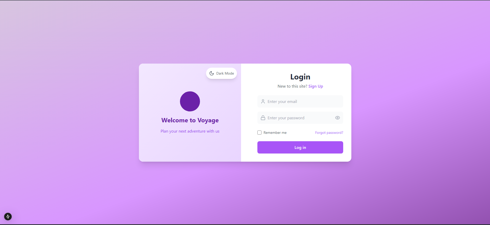
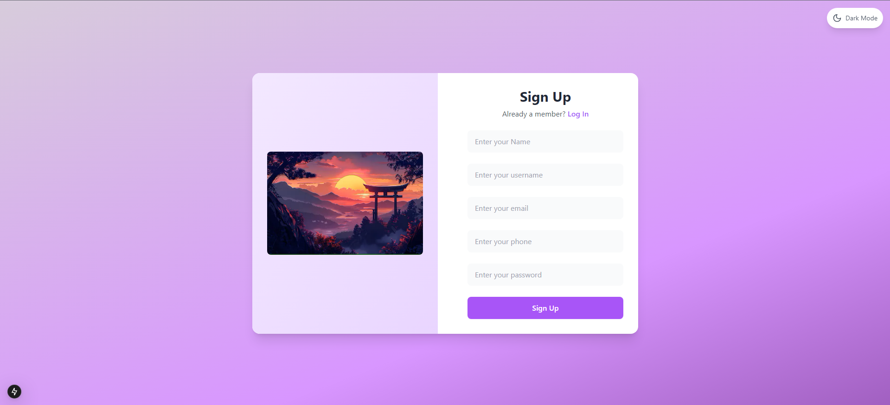
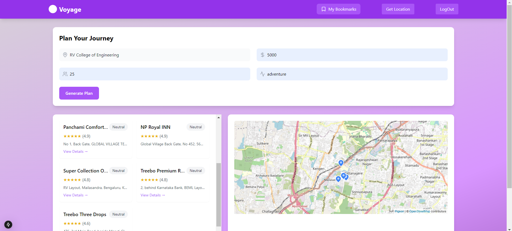
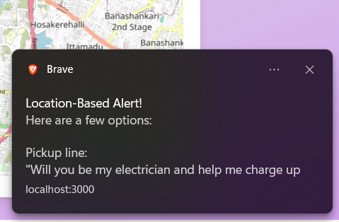
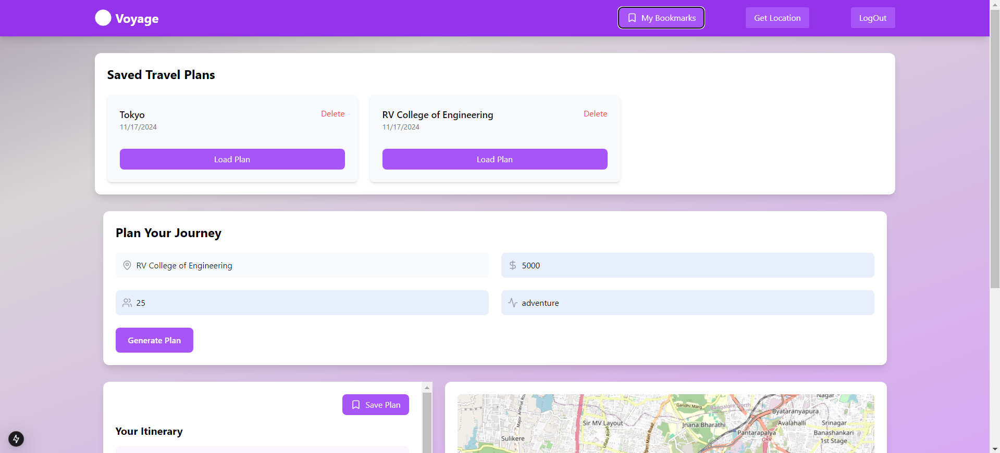

# 🚢 Voyage 

**Voyage** is a cutting-edge full-stack web application designed to provide users with AI-driven travel recommendations. Whether you're a local explorer or a tourist, this platform uses advanced APIs like **SerpAPI** and **Groq** to personalize recommendations based on your preferences, including activities, hotels, and restaurants.

---

## 🌟 Features

- **User Authentication**: Simple and secure sign-up and login system.
- **Personalized Recommendations**: AI-powered recommendations tailored to your preferences.
- **Bookmarks**: Save your favorite recommendations for quick access.
- **Notifications**: Receive timely alerts on updates and offers.
- **API Integration**: Fetches real-time data from **SerpAPI** and **Groq** for accurate recommendations.

---

## 🛠 Tech Stack

- **Frontend**:  
  - **Next.js** for dynamic React applications.
  - **Tailwind CSS** for modern, responsive styling.
  
- **Backend**:  
  - **Flask** for building the API and handling server-side logic.
  - **MongoDB** for storing user data, preferences, and recommendations.
  
- **External APIs**:  
  - **SerpAPI** for gathering travel-related data.
  - **Groq** for personalized content and real-time suggestions.

---

## 🚀 Installation

### 1. Clone the repository

```bash
git clone https://github.com/Rijo-1/HackAttack_WebDev.git
cd HackAttack_WebDev
```

---

### 2. Backend Setup

#### a. Create a virtual environment and activate it

For Linux/macOS:

```bash
python3 -m venv venv
source venv/bin/activate
```

For Windows:

```bash
python -m venv venv
venv\Scripts\activate
```

#### b. Install dependencies

```bash
cd backend
pip install -r requirements.txt
```

#### c. Set up MongoDB

Ensure you have MongoDB running locally or use MongoDB Atlas for a cloud-based solution. Update the connection string in the Flask app accordingly.

#### d. Run the Flask app

```bash
python app.py
```

Your backend will be live on [http://127.0.0.1:5000](http://127.0.0.1:5000).

---

### 3. Frontend Setup

#### a. Install Node.js dependencies

```bash
cd ../frontend
npm install
```

#### b. Start the frontend development server

```bash
npm run dev
```

Your frontend will be available on [http://localhost:3000](http://localhost:3000).

---

## 📸 Screenshots

### Homepage


Explore the homepage where users can begin their travel planning journey.

---

### Login Page


The login page where users can access their personalized travel recommendations.

---

### Sign-up Page


Create a new account to get started with personalized recommendations.

---

### Output Page


Receive tailored recommendations based on your inputs.

---

### Notifications


Get notified about your saved recommendations and updates.

---

### Bookmark Page


Save your favorite travel links and recommendations for quick access.

---

## 👥 Contributors

- **[Mohith](https://github.com/mohithn2004)**
- **[Sandeep Kumar](https://github.com/sandyyman)**
- **[Pavan C Shekar](https://github.com/pavancshekar)**

---


## 🔥 Let's Connect!

For more information or to get involved in the project, feel free to reach out! Your contributions are welcome.

---


